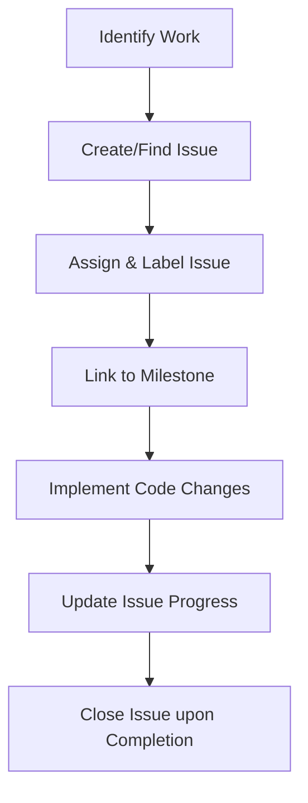

# GitHub Issues Management Guide for AI Dev Agents

This guide outlines the mandatory workflow for all AI development agents working on the **TSMCMedical** repository. Follow these instructions strictly to maintain a clean, organized, and transparent project management history on GitHub.

---

## 1. Core Principles

- **Issue-First Development:** No code changes should be proposed or executed without an associated GitHub Issue.
- **Single Source of Truth:** The GitHub issue list must accurately represent the current backlog, active work, and completed features.
- **Traceability:** Every commit, pull request, or major change must reference its corresponding GitHub issue.

---

## 2. The Development Lifecycle

For every task, the AI agent must follow these stages:



### Stage 1: Issue Creation
Before writing any code, search the repository issues using the `search_issues` tool to check if an issue already exists.
- If it **does not exist**, create a new issue using `issue_write`.
- If it **exists**, read the issue details to align with the objectives.

#### Title Naming Conventions
Issue titles must use semantic prefixing:
- `feat: <Short description>` for new features or enhancements.
- `fix: <Short description>` for bug fixes.
- `docs: <Short description>` for documentation updates.
- `refactor: <Short description>` for code cleanup or restructuring.
- `chore: <Short description>` for dependencies, build settings, or system configuration.

#### Issue Body Structure
Every issue created must contain the following structured sections:
```markdown
## 🎯 Goal
A clear, 1-2 sentence description of what this issue aims to achieve.

## 📋 Scope & Checklist
- [ ] Checklist item 1
- [ ] Checklist item 2

## 🧪 Acceptance Criteria
- [ ] Description of how to verify this work is successful.
```

---

### Stage 2: Assignment & Categorization
Upon creating or picking up an issue, immediately update it:
1. **Assignee:** Assign the issue to the active agent or user.
2. **Labels:** Apply appropriate labels (e.g., `bug`, `enhancement`, `documentation`, `duplicate`, `wontfix`).
3. **Milestone:** Associate the issue with the active milestone if applicable.

---

### Stage 3: Implementation & Tracking
While working on the task:
- Reference the issue ID (e.g., `#12`) in all communication and commit messages.
- If a task is complex or spans multiple phases, post progress updates as comments on the issue using the `add_issue_comment` tool.
- Check off checklist items in the issue description as they are completed.

---

### Stage 4: Resolution & Closure
Once the work is fully implemented, verified, and merged:
- Update the issue to check off all items in the checklist.
- Add a final comment detailing the solution, links to relevant commits or PRs, and manual test results.
- Close the issue.
- Ensure the commit message contains `Fixes #<issue-id>` or `Closes #<issue-id>` to trigger automatic GitHub closure if a pull request is merged.

---

## 3. GitHub MCP Reference Sheet

Use the following tools to manage issues dynamically:

| Action | GitHub MCP Tool | Primary Arguments |
| :--- | :--- | :--- |
| **Search** | `search_issues` | `query` (e.g., `"TSMCMedical state:open"`) |
| **Create/Edit** | `issue_write` | `owner`, `repo`, `title`, `body`, `labels`, `assignees`, `milestone` |
| **Read Details** | `issue_read` | `owner`, `repo`, `issue_number` |
| **Comment** | `add_issue_comment` | `owner`, `repo`, `issue_number`, `body` |
| **List Open** | `list_issues` | `owner`, `repo`, `state: "open"` |

---

> [!IMPORTANT]
> **Always verify before coding:** If you find yourself editing files without a matching open issue, stop, create the issue first, assign it to yourself, and then proceed.
